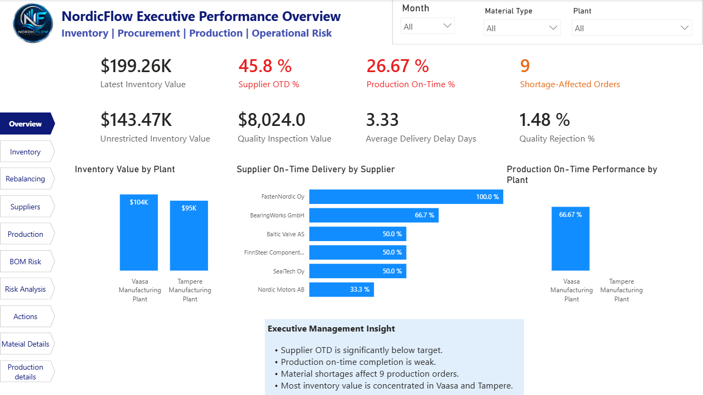
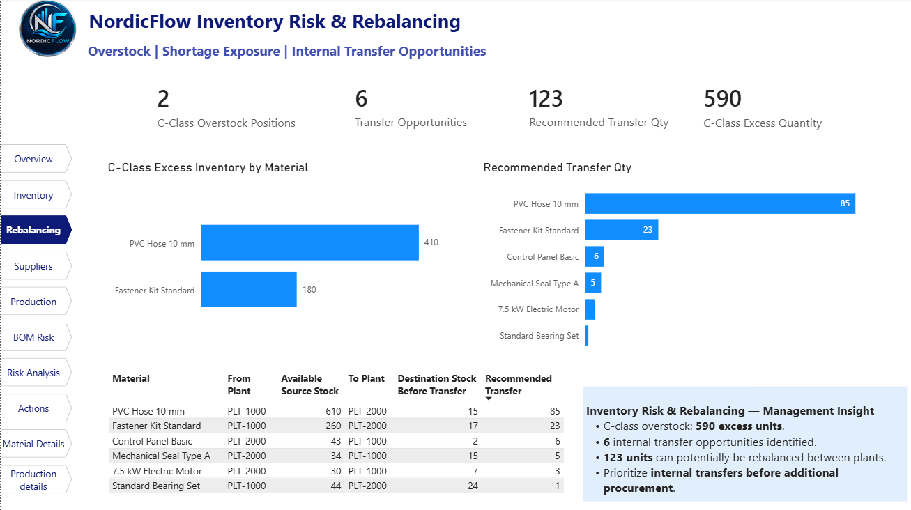
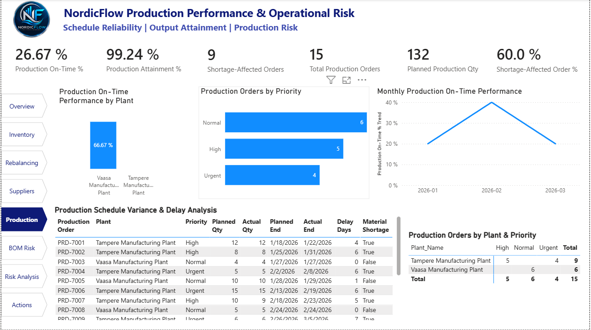
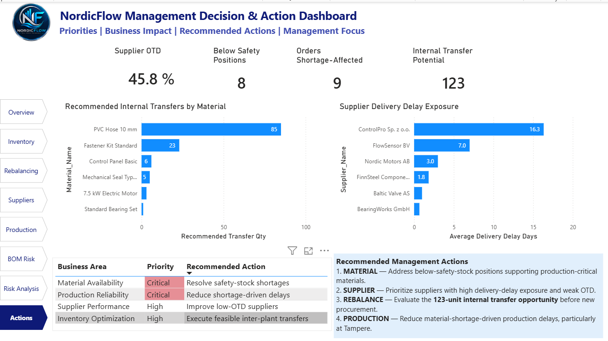

# NordicFlow ERP Analytics

### ERP Data Quality • SQL • Python • Power BI • Decision Support

NordicFlow is an end-to-end manufacturing ERP analytics simulation built to show how operational data can move from raw ERP records to useful management decisions.

The case connects procurement, inventory, suppliers, production and BOM data across one analytical workflow.

**Business question:**

> How can a manufacturing company face material shortages and production delays while inventory is available elsewhere in the organisation?

Instead of treating Excel, SQL, Python and Power BI as separate exercises, I used them at different stages of the same ERP problem.

**Workflow**

`Business Requirements → ERP Data Model → Data Quality → SQL → Python → Power BI → Management Decision Support`

**Tools**

`Excel` · `SQL / SQLite` · `Python / pandas` · `Jupyter Notebook` · `Power BI` · `DAX` · `ERP Data Modelling`

**Phase I:** Projects 01–06 completed  
**Phase II:** Projects 07–12 planned — ERP root-cause analysis, MRP simulation, migration/UAT and AI-assisted ERP analytics

[View the development roadmap](ROADMAP.md)

---

## Dashboard Preview



*Executive view connecting inventory, supplier and production signals for management review.*

---
## Business Challenge

NordicFlow operates a simulated manufacturing and distribution network involving purchasing, inventory management, production planning, supplier management, Bills of Materials and inter-plant material movement.

The scenario contains several interconnected operational risks:

- material shortages at production plants despite inventory elsewhere in the network
- weak supplier delivery reliability
- inventory held in restricted or non-usable stock statuses
- excess inventory in lower-priority materials
- production orders completed late despite strong overall quantity attainment
- BOM dependencies that increase production exposure to selected components
- inconsistent planning and master-data parameters

The objective is not simply to build dashboards.

The project demonstrates how ERP data can be structured, governed, analysed and converted into management decisions.

---

## Consulting Objective

The NordicFlow project aims to demonstrate an ERP/data consulting workflow capable of:

1. understanding the business problem and ERP process context
2. defining ERP information requirements
3. designing a relational ERP data model
4. establishing data-quality and business rules
5. profiling and remediating unreliable ERP data
6. validating an analysis-ready dataset
7. building a relational analytical database
8. investigating business problems using SQL
9. automating repeatable analytics with Python
10. developing a Power BI semantic and reporting layer
11. validating KPIs across analytical tools
12. translating analytical findings into management recommendations

---

## End-to-End Project Architecture

```text
Business Problem
      ↓
ERP Process & Information Requirements
      ↓
ERP Data Model & Business Rules
      ↓
Data Quality Profiling & Governance
      ↓
Data Cleaning & Validation
      ↓
SQL Business Analysis
      ↓
Python Analytics & Automation
      ↓
Power BI Semantic Model
      ↓
Cross-Functional Business Insights
      ↓
Management Decisions & Actions
```

## Phase I — Completed ERP Analytics Workflow

The first phase of NordicFlow is complete. It covers Projects 01–06 and follows one business case through the full analytical process.

| Project | Focus | Main Outcome |
|---|---|---|
| [01 — Business & ERP Foundation](01-business-erp-foundation/) | Business and ERP requirements | Defined the business problem, processes, stakeholders and decision needs |
| [02 — ERP Data Model & Baseline](02-erp-data-model/) | ERP data architecture | Defined entities, keys, relationships, grain and business rules |
| [03 — Excel Data Engineering](03-excel-data-engineering/) | Data quality and preparation | Profiled, cleaned and validated the ERP dataset |
| [04 — SQL Business Analysis](04-sql-business-analysis/) | Business investigation | Analysed inventory, suppliers, production and cross-plant risks |
| [05 — Python ERP Analytics](05-python-erp-analytics/) | Analytics and automation | Built repeatable KPI, risk and management-level analytical outputs |
| [06 — Power BI Executive Dashboard](06-power-bi-executive-dashboard/) | Decision support | Connected the analysis into an interactive management reporting solution |

These projects are not separate tool demonstrations. Each stage uses the previous stage and moves the same ERP case forward.

The completed Phase I can be summarised as:

**Business Problem → ERP Data → Data Quality → SQL → Python → Semantic Model → Power BI → Management Decision / Action**

---

## Selected Business Findings

The analysis showed that NordicFlow's main operational issues were connected rather than isolated.

| Finding | Result | Why It Matters |
|---|---:|---|
| Supplier On-Time Delivery | **45.8%** | Supplier reliability needs attention |
| Production On-Time Performance | **26.67%** | Production quantity alone does not show schedule performance |
| Shortage-Affected Production Orders | **9** | Material availability is contributing to production risk |
| Latest Inventory Value | **$199.26K** | Significant inventory exists across the network |
| Unrestricted Inventory Value | **$143.47K** | Not all inventory is immediately usable |
| C-Class Excess Inventory | **590 units** | Excess stock exists while shortages occur elsewhere |
| Internal Transfer Opportunities | **6** | Some shortages may be supported from another plant |
| Recommended Transfer Quantity | **123 units** | Internal rebalancing can be considered before new purchasing |

One finding became especially useful during the project.

A shortage does not always mean **buy more material**.

When inventory was viewed across plants, some excess stock could potentially support shortages at another location. This moved the analysis from simply reporting stock levels toward a management question:

> **Can existing inventory be used better before creating additional procurement demand?**

---

## Power BI Decision Support

The final Power BI report brings inventory, procurement, supplier, production and BOM information into one connected management view.

### Inventory Rebalancing

The rebalancing page looks for situations where excess stock at one plant may support demand at another.



### Production Performance

Production analysis connects schedule performance with material shortages and other delay information.



### Management Actions

The final layer brings the main analytical signals closer to possible management action.



The full Power BI case includes inventory, suppliers, BOM risk, risk analysis, drill-through pages, report-page tooltips, filtering, navigation and reset controls.

[Explore the complete Power BI project](06-power-bi-executive-dashboard/)

---

## Tools & Capabilities Demonstrated

NordicFlow combines business understanding with several analytical tools.

| Area | Tools / Methods |
|---|---|
| ERP & Business Analysis | Manufacturing processes, procurement, inventory, production, BOM, master data |
| Data Quality | Excel, profiling, validation rules, issue logs, cleaning and governance |
| Database & SQL | SQLite, joins, CTEs, CASE logic, views, validation and business queries |
| Python Analytics | Python, pandas, Jupyter Notebook, reusable analysis and visualisation |
| Power BI | Power Query, data modelling, DAX, semantic model, drill-through, tooltips and navigation |
| Decision Support | KPI validation, root-cause investigation, risk prioritisation and management actions |

The tools are important, but the main focus is how they work together around one business problem.

---

## Phase II — Development Roadmap

Projects 01–06 complete the first NordicFlow analytics phase.

The next phase will extend the same ERP environment rather than start another unrelated simulation.

### 07 — Advanced Semantic Model & DAX

Strengthen the analytical model with more reusable measures, KPI definitions, time-based analysis and clearer semantic structure.

**Focus:** stronger Power BI modelling rather than simply adding more dashboard pages.

### 08 — ERP Data Quality Monitoring & Governance

Move from one-time data cleaning toward ongoing control.

This phase will explore data-quality KPIs, ownership, monitoring rules, master-data governance and exception management.

**Focus:** detecting and managing ERP data problems before they affect reporting and decisions.

### 09 — Forecasting & Scenario Analytics

Extend the historical analysis toward forward-looking questions.

Possible areas include inventory risk, material demand, supplier performance trends and operational scenarios.

**Focus:** move from "what happened?" toward "what may happen next?"

### 10 — Fabric & Analytics Engineering

Explore how the current local workflow could move toward a more modern analytics platform.

This may include data pipelines, reusable transformation layers, governed datasets and Microsoft Fabric components where suitable.

**Focus:** improve scalability and reduce dependence on manual analytical steps.

### 11 — AI-Assisted ERP Analysis

Add an AI-assisted investigation layer on top of the governed ERP data and semantic model.

Possible use cases include:

- natural-language questions about ERP performance
- assisted KPI investigation
- explanation of unusual business signals
- support for DAX or analytical development
- guided exploration of inventory, supplier and production risks

AI will be used as an analytical assistant, not as a replacement for data quality, ERP knowledge or management judgement.

### 12 — Decision Intelligence & Final Integration

Bring the advanced analytical layers together.

The final goal is to connect:

**Business Signal → Root Cause → Scenario → Recommendation → Human Decision / Action**

This phase can also evaluate which parts of the workflow could be automated and which decisions should remain with business owners.

---

## Where AI Fits

AI is intentionally placed later in the NordicFlow roadmap.

The first six projects showed me why this order matters.

If material IDs are wrong, relationships are broken or KPI definitions are unclear, an AI tool can still produce an answer — but the answer may not be trustworthy.

So the planned direction is:

**ERP Business Process → Data Quality → SQL / Python → Semantic Model → Power BI → AI-Assisted Analysis → Human Decision / Action**

The value of AI should come from making reliable business information easier to investigate and use, not from hiding problems in the underlying data.

---

## Repository Guide

If you want a quick view of the project, I recommend this path:

1. Start with the [Power BI Executive Dashboard](06-power-bi-executive-dashboard/) for the final business outcome.
2. Review the [SQL Business Analysis](04-sql-business-analysis/) to see how the main findings were investigated.
3. Open the [Python ERP Analytics](05-python-erp-analytics/) for the notebook-based analysis.
4. Review [Excel Data Engineering](03-excel-data-engineering/) to see how the data was cleaned and validated.
5. Use the [ERP Data Model](02-erp-data-model/) and [Business & ERP Foundation](01-business-erp-foundation/) for the underlying design and business context.

For a full review, follow Projects 01–06 in numerical order.

---

## Current Status

**Phase I — Projects 01–06: Completed**

**Phase II — Projects 07–12: Planned / In Development**

The repository currently contains the completed Phase I work. Phase II will be added progressively as the NordicFlow environment develops.

---

## Simulation Notice

NordicFlow Manufacturing Oy is fictional.

The company, ERP data and business situations were created for portfolio and learning purposes. The project does not represent a live NordicFlow implementation or client engagement.

The purpose is to demonstrate an end-to-end approach to ERP data, data quality, analytics and business decision support.
